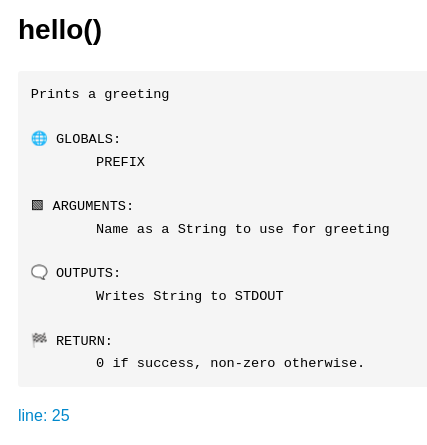

## Introduction

OK, there is a parser that will generate a documentation for me.

Hey, but what is rendered and what do I need to do that the result looks good?

If you write a function in bash without a comment above like this:

```bash
function dosomething(){
    ...
}
```
... then the parser can't render something beautiful. It cannot guess what it does. It needs your help.

You need to add a comment to render a description as commented lines above the function:

```bash
# dosomething
# The function does something nice for me
function dosomething(){
    ...
}
```

The docblock is found by finding the line number of the function. The algorithm goes up until it doesn't find a line with a comment. 
Everything from start of line including hash sign is removed. 

Then the following lines will be removed:

* lines with 5 following characters: of `-`, `.`, `=`, `_`, `#`
* lines matching `/FUNCTION (BEGIN|END)/i`

This is our docblock.

The parser detects function names starting with underscore (`_`). Those will be handled as a private function and will be ignored by default. But with the option `-p` you can show them too.


## Shell doc blocks

### Example

Let's have a look at a shell doc blocks example.

```shell
PREFIX="Hello"

#### FUNCTION BEGIN
# Prints a greeting
#
# GLOBALS: 
# 	PREFIX
#
# ARGUMENTS: 
# 	Name as a String to use for greeting
#
# OUTPUTS: 
# 	Writes String to STDOUT
#
# RETURN: 
# 	0 if success, non-zero otherwise.
### FUNCTION END
function hello(){
    echo "$PREFIX $1"
}
```

The generated and parsed markdown looks like this:



### Parsed elements

If one of the regex below match a line then the show icon will be added.

| Regex            | Comment   | Icon
| --               | --        | --
| `/^globals:/i`   | GLOBALS   | 🌐
| `/^arguments:/i` | ARGUMENTS | 🟩
| `/^outputs:/i`   | OUTPUTS   | 🗨️
| `/^return:/i`    | RETURN    | 🏁
| `/^returns:/i`   | RETURNS   | 🏁

## Php like doc blocks

### Example

```shell
PREFIX="Hello"

# Prints a greeting.
# It uses a global var for a prefix.
#
# TODO: add optional param
# see   https://github.com/axelhahn/bashdoc/issues/3 maybe somewhere else
#
# global  PREFIX  string  prefix before name
#
# param  string  Name to use for greeting
#
# return  0 if success, non-zero otherwise.
### FUNCTION END
function hello(){
    echo "$PREFIX $1"
}
```


### Parsed elements

The documentation generator detects a few keywords in the doc block.
If one of the regex below match a line then the show icon will be added.

| Regex                    | Comment         | Icon
| --                       | --              | --
| `/^global[[:space:]]/i`  | Global variable | 🌐
| `/^param[[:space:]]/i`   | Parameter       | 🟩 or 🔹 when "optional:" was found in description part
| `/^return[[:space:]]/i`  | Return value    | 🏁

## Additional icons

| Regex                    | Comment                            | Icon
| --                       | --                                 | --
| `/^see[\ :]/i`           | See other function or url or place | 👉🏼
| `/^todo[\ :]/i`          | TODO marker                        | 📌
