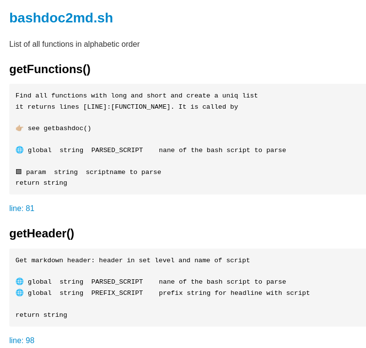

# Bashdoc

Generate markdown for documentation of all functions in a file.

This is my helper to parse a bash script and read its functions and their doc blocks.
It generates markdown output to generate an automated documentation.

- - -

👤 Author: Axel Hahn\
🧾 Source: <https://github.com/axelhahn/bashdoc/>\
📜 License: GNU GPL 3.0\
📗 Docs: see <https://www.axel-hahn.de/docs/bashdoc/>

## Screenshot

**Example:**

The documentation of the script itself is here: [bashdoc2md.sh.md](docs/99_Functions/bashdoc2md.sh.md)

