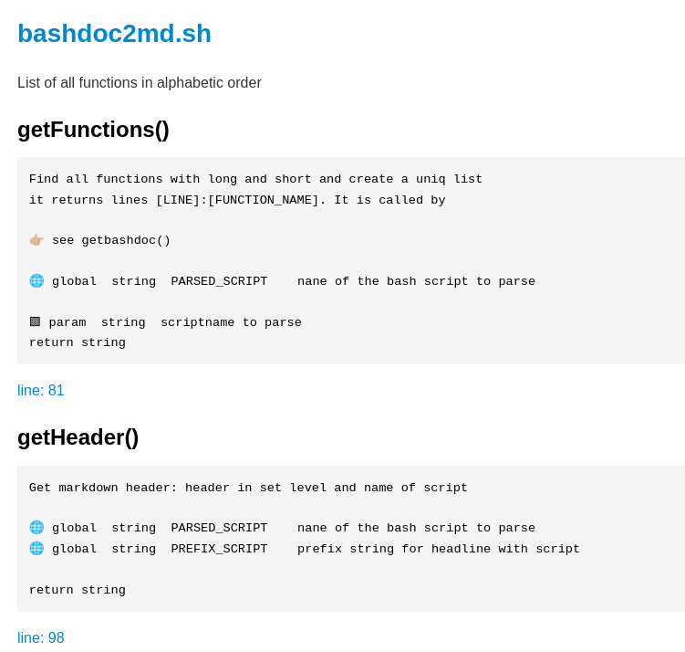

# Bashdoc

Generate markdown for documentation of all functions in a bash script.

This is my helper to parse a bash script and read its functions and their doc blocks.
It generates markdown output to generate an automated documentation.

- - -

👤 Author: Axel Hahn\
🧾 Source: <https://github.com/axelhahn/bashdoc/>\
📜 License: GNU GPL 3.0\
📗 Docs: see <https://www.axel-hahn.de/docs/bashdoc/>

## 📺 Screenshot

**Example:**

The documentation of the script itself is here: [bashdoc2md.sh.md](docs/99_Functions/bashdoc2md.sh.md)

## 👉 Examples

Other real life examples for rendered docs you can see here:

* bash color functions - file [color.class.sh](https://github.com/axelhahn/bash_colorfunctions/blob/main/docs/99_Functions/color.class.sh.md)
* bash ini parser - file [ini.class.sh](https://github.com/axelhahn/bash_iniparser/blob/main/docs/50_All_functions.md)
* bash sqlite functions - file [sqlite.class.sh](https://github.com/axelhahn/bash_sqlite/blob/main/docs/50_All_functions.md)
* bash rest api client - file [http.class.sh](https://git-repo.iml.unibe.ch/iml-open-source/bash-rest-api-client/-/blob/master/docs/99_Functions/http.class.sh.md)

## 📗 Related projects

### PHP Doc generator

A PHP script to generate a markdown doc page with all functions of a PHP class: <https://github.com/axelhahn/php-classdoc>
